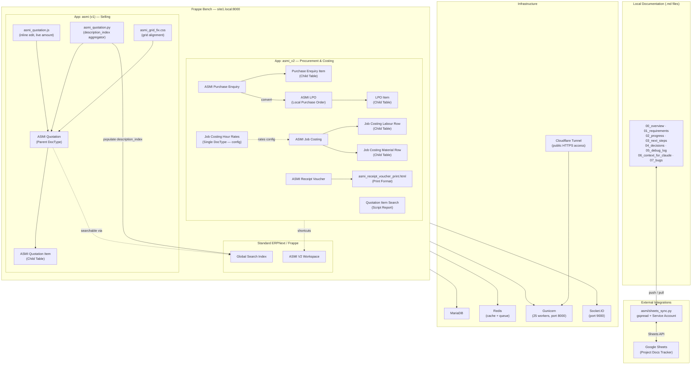

# Architecture — ASMI ERPNext Custom

Custom ERPNext v15 apps built for ASMI (Al Shehab Metal Industries) to handle their selling, procurement, job costing, and payment workflows, extending the standard Frappe/ERPNext platform with bespoke doctypes, client-side logic, print formats, and a Google Sheets sync utility for project documentation.

